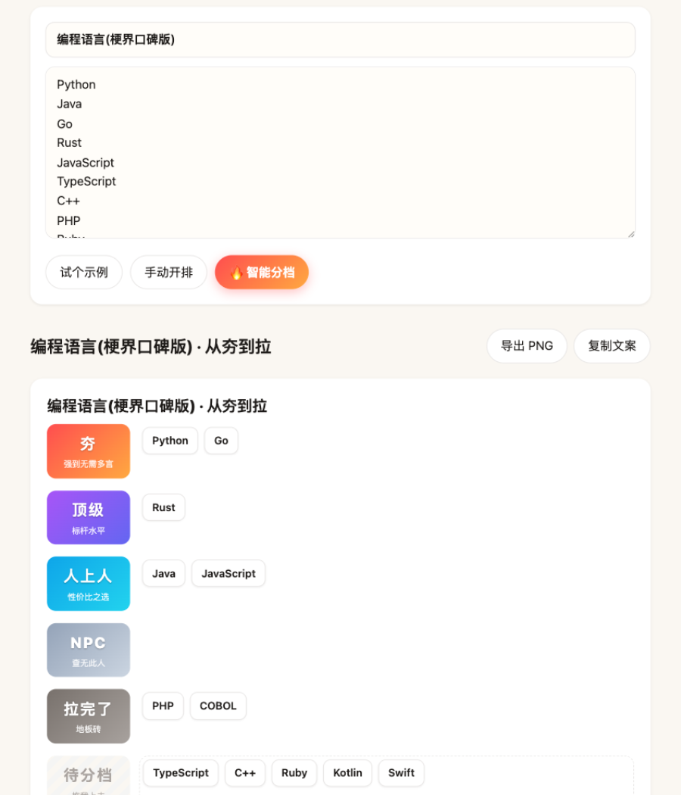

# 从夯到拉 hang2la

> AI 帮你排,拖拽随你改 —— 夯 / 顶级 / 人上人 / NPC / 拉完了



**[在线使用](https://liyuankui.github.io/hang2la/)** · 零安装、零后端、纯静态

输入主题和条目清单,AI 一键分五档并附毒舌点评;不满意就拖,拖完导出 PNG 发帖。

## 怎么玩

1. 填主题(如「编程语言」「奶茶品牌」)和条目(每行一个,最多 30 个);没条目?填个数量点「✨ AI 列条目」让 AI 想几个
2. 点「🔥 智能分档」——没有 Key 也能点「手动开排」自己拖
3. 可选「🎨 AI 配图」:免费 AI 给每条生成小图标(无需 Key,走 Pollinations;串行生成约 1-2 分钟,失败的再点一次补齐)
4. 拖拽微调 → 「导出 PNG」或「复制文案」
5. 右上角「EN / 中文」一键切换双语界面(档位:夯/顶级/人上人/NPC/拉完了 ↔ GOATED/S-TIER/A-TIER/NPC/TRASHED)

## 免费 AI 从哪来

本项目纯前端、无服务器,你的 API Key 只存在自己浏览器的 localStorage,请求直发你选的供应商:

| 供应商 | 免费额度 | 领 Key |
|--------|----------|--------|
| OpenRouter(默认) | `:free` 后缀模型免费 | [openrouter.ai/keys](https://openrouter.ai/keys) |
| 智谱 BigModel | GLM-4-Flash 免费档 | [open.bigmodel.cn](https://open.bigmodel.cn/usercenter/apikeys) |
| DeepSeek / OpenAI / 任意 OpenAI 兼容 | 按量付费 | 设置里自定义 Base URL |

> 免费模型高峰期可能限流(报 429 就换一个 `:free` 模型重试),模型会轮换,可在设置里随时改。

## 隐私

- API Key 仅存本地浏览器,不上传任何服务器
- AI 配图为匿名请求,只发主题与条目名,不含任何 Key
- 匿名使用统计默认开启,页脚一键关闭,关闭后零网络请求(见 [POSTHOG_ANALYTICS.md](POSTHOG_ANALYTICS.md))

## 开发

```bash
bun test          # 核心逻辑测试
bunx serve .      # 本地预览 http://localhost:3000
```

零构建:原生 ES Modules,无框架无依赖。

## License

MIT
